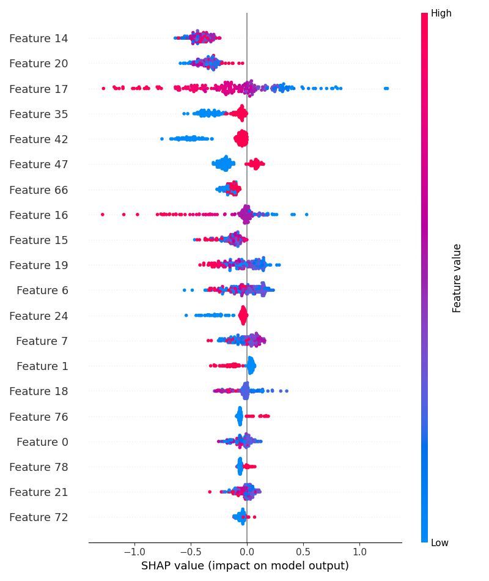

# 🏦 Loan Default Prediction

> An end-to-end machine learning system to predict whether a borrower will default on a loan — with explainability, drift monitoring, experiment tracking, and a REST API, all containerized with Docker.

---

## 📌 Overview

This project builds a production-style ML pipeline for **binary classification** — predicting loan default risk from applicant and loan features. It goes beyond just training a model: it tracks experiments with **MLflow**, explains predictions with **SHAP**, monitors data drift with **PSI/KS/CSI**, and serves predictions via a **Flask REST API** deployable with **Docker**.

---

## 🗂️ Project Structure

```
loan-default-prediction/
│
├── app.py              # Flask REST API for real-time prediction
├── model.py            # Data preprocessing, feature engineering, training & MLflow logging
├── drift.py            # Data drift detection (PSI, KS, CSI)
├── explain.py          # SHAP-based model explainability
├── requirements.txt    # Python dependencies
├── Dockerfile          # Docker configuration
├── shap_summary.png    # SHAP feature importance plot (generated after training)
└── data/
    └── dataset.csv     # Place your dataset here
```

---

## ⚙️ Tech Stack

| Component | Technology |
|---|---|
| Language | Python 3.9 |
| ML Models | XGBoost, Logistic Regression |
| Preprocessing | scikit-learn Pipelines (Imputer, Scaler, OneHotEncoder) |
| Imbalance Handling | SMOTE (`imbalanced-learn`) |
| Explainability | SHAP |
| Experiment Tracking | MLflow |
| Drift Detection | scipy (KS), custom PSI & CSI |
| API | Flask |
| Containerization | Docker |

---

## 🚀 Quick Start

### 1. Clone the Repository

```bash
git clone https://github.com/your-username/loan-default-prediction.git
cd loan-default-prediction
```

### 2. Add Your Dataset

Place your CSV file inside the `data/` folder:

```bash
cp /path/to/your/dataset.csv data/dataset.csv
```

> The dataset should contain loan applicant features and a `Default` target column (0 = No Default, 1 = Default).

### 3. Install Dependencies

```bash
pip install -r requirements.txt
```

### 4. Train the Model

```bash
python model.py
```

This will:
- Load and clean the dataset
- Engineer features (`loan_income_ratio`, `annuity_income_ratio`)
- Apply IQR-based outlier capping
- Build a preprocessing pipeline (imputation → scaling/encoding)
- Apply SMOTE to address class imbalance
- Train and compare **Logistic Regression** (baseline), **Logistic L1**, and **XGBoost** (tuned)
- Log all experiments, metrics, drift scores, and SHAP plots to **MLflow**
- Save the final XGBoost pipeline to `model.pkl`

### 5. Run SHAP Explainability

```bash
python explain.py
```

Generates a SHAP summary plot showing which features most impact default predictions.

### 6. Check for Data Drift

Import the drift utilities in your monitoring script:

```python
from drift import calculate_psi, calculate_ks, calculate_csi

psi = calculate_psi(train_scores, new_scores)
ks  = calculate_ks(train_scores, new_scores)
csi = calculate_csi(train_scores, new_scores)
```

### 7. Launch the Prediction API

```bash
python app.py
```

API available at: `http://localhost:5000`

### 8. View MLflow Experiments

```bash
mlflow ui
```

Open: `http://localhost:5001` — view all runs, metrics, parameters, and SHAP artifacts.

---

## 🐳 Docker Deployment

### Build the Image

```bash
docker build -t loan-default-app .
```

### Run the Container

```bash
docker run -p 5000:5000 -v $(pwd)/data:/app/data loan-default-app
```

### Train Inside the Container

```bash
docker exec <container_id> python model.py
```

---

## 🔌 API Reference

### `POST /predict`

Predicts loan default risk from applicant data.

**Request:**

```bash
curl -X POST http://localhost:5000/predict \
  -H "Content-Type: application/json" \
  -d '{
    "Client_Income": 30000,
    "Credit_Amount": 150000,
    "Loan_Annuity": 5000,
    "Age_Years": 35,
    "Car_Owned": 1,
    "Active_Loan": 0,
    "Child_Count": 2
  }'
```

**Response:**

```json
{
  "prediction": 0,
  "default_probability": 0.124
}
```

| Field | Description |
|---|---|
| `prediction` | `0` = No Default, `1` = Default |
| `default_probability` | Model's estimated probability of default (0–1) |

### `GET /`

Health check — returns a status message.

---

## 🧪 Models & Experiments

Three models are trained and logged to MLflow for comparison:

| Run Name | Model | Notes |
|---|---|---|
| `Logistic` | Logistic Regression | Baseline |
| `Logistic L1` | Logistic Regression (L1) | Sparse feature selection |
| `XGBoost Tuned` | XGBoost | Tuned hyperparams, `scale_pos_weight=3` for imbalance |

All runs log: **AUC, Precision, Recall, F1**, decision threshold, drift metrics, and SHAP summary plot.

---

## 📊 SHAP Explainability

After training, SHAP values are computed on a 200-sample test subset to explain model predictions globally.



> Each dot is one prediction. Color = feature value (red = high, blue = low). X-axis = impact on model output (positive = increases default risk).

---

## 📉 Drift Detection

The `drift.py` module provides three complementary drift metrics:

| Metric | Method | Interpretation |
|---|---|---|
| **PSI** | Population Stability Index | Measures shift in score distribution |
| **KS** | Kolmogorov-Smirnov statistic | Tests if two distributions differ significantly |
| **CSI** | Characteristic Stability Index | Mean absolute difference between distributions |

**Recommended Thresholds:**

| Metric | No Drift | Moderate Drift | Significant Drift |
|---|---|---|---|
| PSI | < 0.10 | 0.10 – 0.20 | > 0.20 |
| CSI | < 0.10 | 0.10 – 0.20 | > 0.20 |
| KS | p > 0.05 | — | p < 0.05 |

---

## 🧠 Feature Engineering

| Feature | Formula | Purpose |
|---|---|---|
| `loan_income_ratio` | `Credit_Amount / (Client_Income + 1)` | Debt burden relative to income |
| `annuity_income_ratio` | `Loan_Annuity / (Client_Income + 1)` | Monthly repayment stress |

Additional preprocessing:
- **High-cardinality columns** (>50 unique values) are dropped
- **Outliers** are capped using the IQR method (1.5× fence)
- **Missing values** are imputed with median (numeric) and mode (categorical)

---

## 📋 Requirements

```
pandas
numpy
scikit-learn
xgboost
imbalanced-learn
mlflow
shap
flask
scipy
matplotlib
```

Install with:

```bash
pip install -r requirements.txt
```

---

## 👤 Author

**Givaji Pravalika**  
Loan Default Prediction
